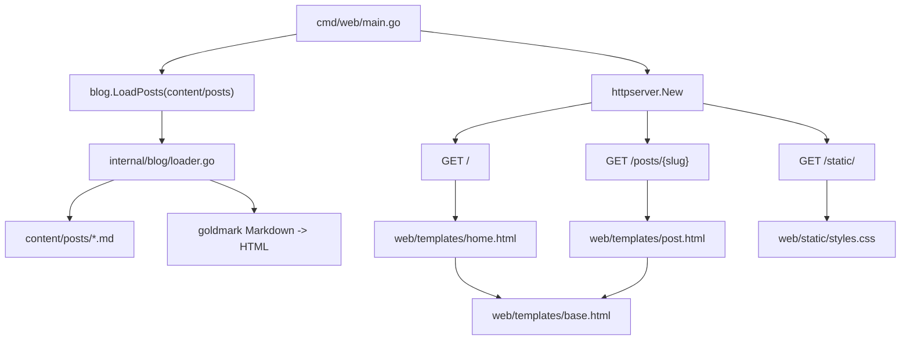

# Briefingfy Blog - Project Context

> [!summary]
> Contexto Obsidian/agent friendly para retomar o projeto sem depender da conversa original.

## Estado Atual

- Projeto: blog server-side rendered em Go.
- Repositorio GitHub: https://github.com/KKxola/briefingfy-blog
- Hospedagem alvo: Render Free Web Service.
- URL publica Render: ainda nao criada.
- App validado localmente com `go test ./...` e rotas principais.

## Stack Aprovada

- Go 1.22+
- `net/http`
- `html/template`
- `testing` + `httptest`
- `github.com/yuin/goldmark`
- CSS puro
- Posts em Markdown em `content/posts/*.md`

## Decisoes

| Decisao | Motivo |
|---|---|
| Criar projeto novo | O repo local estava vazio fora de `.git` no inventario inicial. |
| Usar `net/http` | Evitar framework web externo. |
| Usar `html/template` | SSR simples e nativo do Go. |
| Usar Markdown em arquivos | Blog simples, sem banco e sem admin. |
| Usar goldmark | Dependencia aprovada para converter Markdown em HTML. |
| Usar Render | URL publica gratuita, sem Docker, adequada para Go simples. |
| Preservar `go.sum` | Necessario para checksum da dependencia Go. |

## Arquitetura



## Arquivos Principais

- `go.mod`: modulo `briefingfy`, Go 1.22, goldmark.
- `cmd/web/main.go`: carrega posts, cria handler, usa `PORT` com fallback `8080`.
- `internal/blog/post.go`: modelo `Post`.
- `internal/blog/loader.go`: carrega Markdown, parseia front matter, valida campos, ordena por data, converte para HTML.
- `internal/httpserver/server.go`: rotas `/`, `/posts/{slug}`, `/static/`, 404 e 405 explicitos.
- `content/posts/hello-world.md`: post exemplo.
- `web/templates/*.html`: templates SSR.
- `web/static/styles.css`: visual do blog.
- `README.md`: comandos locais e deploy no Render.

## Testes Executados

```sh
go test ./...
```

Resultado local mais recente:

```text
?       briefingfy/cmd/web      [no test files]
ok      briefingfy/internal/blog        (cached)
ok      briefingfy/internal/httpserver  (cached)
```

## Validacoes HTTP Locais

Rotas verificadas anteriormente:

- `/` -> 200
- `/posts/hello-world` -> 200
- `/static/styles.css` -> 200

## Deploy No Render

No Render:

1. New > Web Service.
2. Conectar `KKxola/briefingfy-blog`.
3. Instance Type: Free.
4. Build Command:

```sh
go build -tags netgo -ldflags '-s -w' -o app ./cmd/web
```

5. Start Command:

```sh
./app
```

6. Confirmar que o Render injeta `PORT`; o app ja le `PORT`.
7. Aguardar a URL `*.onrender.com`.

## Restricoes

- Nao adicionar framework web.
- Nao adicionar banco.
- Nao criar admin/CMS.
- Nao criar autenticacao.
- Nao criar Dockerfile sem novo pedido.
- Nao adicionar JavaScript obrigatorio.
- Nao adicionar framework CSS.
- Preservar posts em Markdown.

## Riscos E Dividas

- Render Free pode dormir apos inatividade.
- O primeiro acesso apos dormir pode demorar.
- Filesystem do Render Free nao e persistente.
- `template.HTML` assume posts locais confiaveis; sanitizar se autores nao confiaveis entrarem.
- Front matter e simples, nao YAML completo.
- O push Git HTTPS local falhou por falta de token/credencial; os arquivos foram publicados via conector GitHub.

## Proximos Passos

1. Criar Web Service no Render a partir de `KKxola/briefingfy-blog`.
2. Copiar a URL `*.onrender.com`.
3. Registrar a URL neste arquivo e no README se desejado.
4. Opcional: configurar credenciais locais GitHub para futuros `git push` diretos.
